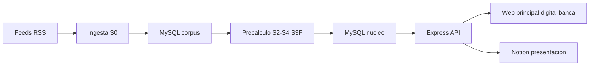

# open-news v2.1 · Arquitectura e implementación definitiva

Documento unificado (fuente de verdad de la implementación). Consolida el estado real del sistema, el despliegue, el pipeline, la capa de datos (MySQL / archivos / Notion), la configuración, el sync y las decisiones. Sustituye a los documentos parciales anteriores.

---

## 1. Estado real (implementado)

| Área | Estado |
|---|---|
| Runtime | Node.js ≥ 20 (ESM), Express 4 |
| Estructura | `src/core/`, `src/llm/`, `src/products/`, `src/notion/`, `src/filter/`, `src/signals/`, `src/rules/`, `src/search/`, `src/store/`, `src/prompts/`, `src/config/`, `scripts/`, `public/`, `tests/`, `db/` |
| Pipeline | `ingest` (TVN RSS + GDELT + Banco Mundial + USGS) → `load` → `precache` (IA) |
| Núcleo IA | P01–P05 + contraste oficial + P06 **cableados**; enriquecimiento **secuencial** |
| Filtro S3F | SC-01..SC-10, rutas pasa/con_advertencias/retenido, liberación humana |
| Validaciones | V01–V11 en código |
| Capa de datos | Archivos `data/` + Notion (presentación) + **MySQL desplegado y migrado** (base `open_news`: 155 noticias, 153 eventos, 459 fichas) |
| Configuración | `src/config/defaults.js` + `.env`; sin backend de configuración aún |
| Pruebas | 20/20 en `node --test` |

## 2. Despliegue en producción

| Host | Contenido | Proceso / puerto |
|---|---|---|
| `sancochodev.com` | Hub con enlaces | nginx + PHP-FPM |
| `open-news.sancochodev.com` | Landing + `/principal` `/digital` `/banca` | PM2 `open-news` · 3001 |
| `preauth.sancochodev.com` | Landing + app `/preauth` + admin `/admin` | PM2 `preauth-agent` · 3000 |

- Nginx: server blocks por subdominio; vhost default de Webdock solo `sancochodev.com`.
- Datos reales en producción: 155 noticias TVN + 82 sismos USGS → 153 eventos → **150 en bandeja + 3 retenidos** por modalidad.

## 3. Arquitectura de alto nivel

Dos planos: **batch** (ingesta → MySQL → precálculo → MySQL) y **online** (API → web → revisión → Notion). El pipeline escribe directamente en MySQL; los archivos `data/` quedan solo como corpus reproducible (manifest SHA-256) y respaldo.

## 4. Pipeline de datos

- `S0 Fuentes`: TVN RSS (155 noticias), USGS (82 sismos) → **escribe en MySQL** (`noticias`, `sismos`, `fuentes`, `capturas`). GDELT y Banco Mundial dieron timeout desde el VPS (omitidos).
- `S1 Cargar`: validación + cuarentena + normalización → **escribe `noticias` normalizadas en MySQL**. 0 rechazados tras corregir el parser CSV.
- `S2-S4 + S3F`: lee de MySQL y **escribe** `eventos`, `afirmaciones`, `citas`, `fichas`, `senales_ficha`.
- Enriquecimiento IA: P01 (organiza) → P02 (afirmaciones) → P03 (contradicciones) → P04 (credibilidad) → P05 (impacto) → contraste oficial → P06 (resumen). **Secuencial** (153 eventos × 6 llamadas ≈ 64 min).

## 5. Núcleo IA y modelo

- Proveedor: DeepSeek `deepseek-chat` (V3) primario; `deepseek-reasoner` (R1) fallback.
- Cliente perezoso ([`llm/client.js`](open-news/src/llm/client.js:1)); `safeJsonParse` tolerante; 1 reintento en [`llm/schema.js`](open-news/src/llm/schema.js:1).
- Modelo **hardcodeado por paso** en [`core/ia.js`](open-news/src/core/ia.js:108) — pendiente externalizar.

## 6. Filtro S3F y RIUNE

- `P = 30R + 25I + 20U + 15N + 10E`; bandas bajo/medio/alto; estado de evidencia insuficiente/parcial/suficiente.
- SC-01..SC-10 con nivel/origen; ruta pasa/con_advertencias/retenido; liberación humana con motivo.

## 7. Capa de producto y validaciones

- `principal` (Mesa Editorial), `digital` (Mesa Digital), `banca` (Radar de Entorno).
- V01–V11: esquema, citas, pasaje literal, cifras, límites, aviso, léxico, año, estados, secretos, retenido.

## 8. Capa de datos — reparto

| Dato | Destino |
|---|---|
| `noticias`, `sismos`, `fuentes`, `indicadores`, `oficiales` | MySQL (corpus) |
| `eventos`, `evento_noticias`, `afirmaciones`, `citas`, `fichas`, `senales_ficha` | MySQL (núcleo) |
| `revisiones`, `verificaciones`, `entregables`, `consultas`, `bitacora` | MySQL (solo-anejo) |
| Fichas **trabajadas**, revisiones, bitácora, reglas, prompts, fuentes, ejecuciones, pruebas | Notion (presentación/traza) |
| Corpus reproducible (manifest SHA-256) | Archivos `data/` + respaldo JSONL |
| Demo sintética + corpus de estrés | Solo demo manual (nunca producción) |

El pipeline escribe directamente en MySQL; los archivos `data/` son solo respaldo/corpus reproducible (manifest SHA-256).

## 9. Esquema MySQL

Definido en [`db/esquema.sql`](open-news/db/esquema.sql:1) (adaptado a los campos reales): `fuentes`, `capturas`, `noticias`, `indicadores`, `sismos`, `oficiales`, `eventos`, `evento_noticias`, `afirmaciones`, `citas`, `fichas`, `senales_ficha`, `revisiones`, `verificaciones`, `entregables`, `consultas`, `bitacora`, `ejecuciones`, `cache_llm`, `esquema_version`.

**Estado: desplegado** — base `open_news` en MariaDB 11.5.2 con la data ya procesada cargada (carga puntual de una sola vez, no recurrente). Conteos: noticias 155 · sismos 82 · fuentes 1 · eventos 153 · evento_noticias 155 · afirmaciones 231 · citas 231 · fichas 459 · senales_ficha 102.

Inventario completo (mapeo archivo→tabla, todas las tablas MySQL/Notion y backend): [`INVENTARIO-BD.md`](open-news/docs/INVENTARIO-BD.md:1).

## 10. Configuración (inventario y backend)

- **Hardcodeado**: modelo DeepSeek (por paso), prompts P00–P09/RG-1.0, pesos RIUNE, bandas, modalidades, temas, sectores, geo, umbrales, léxicos, límites, paleta, fuentes de ingesta.
- **`MODO_OFFLINE=auto`**: solo se reporta en `/api/estado`; el fallback sin red es automático.
- **Backend propuesto**: Notion «open-news · Configuración» + `data/config.json` + API `/api/admin/config` + UI `/admin` (patrón PreAuth [`ajustes.js`](hackiathon-preauth/src/config/ajustes.js:1)).

## 11. Sync Notion (alineado al esquema real)

- [`sync.js`](open-news/src/notion/sync.js:1) reescrito con normalizadores: `Modalidad` (principal→TVN · Principal), `Tema` (slug→label), `Nivel de atención`, `Estado de revisión`, `Alcance del texto`, `Decisión`.
- `Señales` objeto → etiqueta multi_select; `Persona revisora`/`Persona` como **people** (mapa nombre→user); no se escribe `Banda` (formula).
- Esquema Notion ajustado: añadidos `Ruta FD`, `Liberado por`, `Motivo de liberación`, `SC-10 Revisión externa`.
- Sincronización unidireccional e idempotente (buscar por `ID caso`). Prueba de humo OK.
- **No hay carga masiva a Notion**: solo se sincronizan **fichas trabajadas** (perezoso, al revisar/producir). El corpus completo vive en MySQL/archivos; Notion es presentación/traza.

## 12. Contrato de API

`GET /health`, `/api/estado`, `/api/modulos`, `/api/{modulo}/bandeja`, `/api/{modulo}/verificacion`, `/api/{modulo}/ficha/{id}`, `/api/{modulo}/consulta`, `/api/{modulo}/ficha/{id}/entregable`, `/api/{modulo}/ficha/{id}/revision`, `/api/{modulo}/verificacion/{id}`, `/api/{modulo}/ficha/{id}/exportar`, `/api/revisiones/{id}`, `/api/metricas`.
- Propuestos: `/api/config`, `/api/admin/config`, `/api/admin/ingest`.

## 13. Bugs corregidos

1. **Parser CSV** ([`parsearCsv`](open-news/src/core/load.js:45)): partía filas por `\n` sin respetar comillas → 98 falsos rechazos. Corregido con estado de comillas.
2. **Ingesta** ([`ingest.js`](open-news/scripts/ingest.js:36)): colapso de espacios/saltos.
3. **Log de precache** ([`precache.js`](open-news/scripts/precache.js:24)): `fichas.length` sobre objeto → conteos correctos.
4. **`fichas.jsonl`** ([`precache.js`](open-news/scripts/precache.js:28)): guardaba las bandejas; ahora guarda fichas reales.
5. **Notion token**: `.env` apuntaba a la integración equivocada; corregido a la integración de open-news.

## 14. Decisiones y pendientes

1. **Paralelizar enriquecimiento IA** (F-01): concurrencia limitada 5–10.
2. **Modo offline explícito** (estado derivado) o modos forzados.
3. ~~Desplegar MySQL~~ **hecho** — falta conectar el servidor web a MySQL (`precalculo:mysql`).
4. **Proveedor con respaldo** en cadena (`LLM_*`/`LLM2_*`).
5. **Backend de configuración** (Notion + JSON + API + UI).
6. **Autenticación** (`DEMO_CODE` + cookie firmada).
7. **Observabilidad** (log JSON por llamada + resumen en `/api/estado`).
8. **Catálogo de 20 feeds** + salud de feeds.
9. **Ciclo diario PM2** (`open-news-ciclo`).
10. **People en Notion**: resolver nombre→user id.
11. **Rehacer la interfaz web** usando `open-news_3.html` como modelo (sección 18).

## 15. Riesgos

F-01 precálculo IA lento · F-02 caída de proveedor · F-03 IDs Notion · F-04 persistencia · F-05 P02/P05 en solo-titular · F-06 demo sin auth · F-07 observabilidad · F-08 comparación IA vs baseline · F-09 escritura Notion · F-14 esquema Notion (resuelto en esta iteración).

## 16. Repositorio y comandos

- `npm run ingest` / `load` / `precache` · `npm start` · `npm test` · `npm run check:deepseek` · `npm run scan` · `npm run demo`.
- `db/esquema.sql` (esquema MySQL).

## 18. Modelo de interfaz de usuario (referencia [`open-news_3.html`](open-news/docs/open-news_3.html:1))

`open-news_3.html` es el **modelo de referencia visual y funcional** para la nueva interfaz web de los tres módulos (Mesa Editorial, Mesa Digital y Radar de Entorno). Es la versión autónoma (bundle con CSS + JS embebido, registro en localStorage y `fetch('/api/...')` interceptado) que define la UX a replicar en el servidor Express; **no se entrega como archivo suelto**.

### 18.1 Design tokens (paleta)

- `--azul #005588` · `--noche #0B1220` · `--amarillo #FEC526` · `--fondo #F5F7F9` · `--tinta #2A2A2A` · `--gris #5A6673` · `--linea #E3E7EB` · verde `#15A34A` · rojo `#C0392B`.
- Por módulo: `principal #005588`, `digital #06ACCB`, `banca #B8892B`.
- Dos ediciones del mismo producto: `data-producto="tvn"` (paleta original) y `data-producto="banco"` (verde `#0E2620` + dorado `#E0B54A`).

### 18.2 Estructura de pantallas

- **Landing**: hero «De la señal a la decisión» + tarjetas de módulo (usuario, entregables, nº eventos) + franja de confianza (4 ítems) + «Un núcleo, dos retos» (TVN Media / núcleo común / Banco Sancocho).
- **Workspace** (3 columnas): izquierda = bandeja (filtros, Top-5 separado de «Siguientes», paginación de 20); centro = ficha; derecha = revisión humana + consulta rápida.
- **Pestañas**: Bandeja (Radar sectorial en banca) · Consulta · Entregables · Verificación (contador de retenidos) · Historial.

### 18.3 Componentes clave

- **Ficha**: componentes RIUNE con barra y peso, P total con banda/rango, «por qué está aquí», fórmula desplegable, señales S3F (nivel/origen/razón + citas), señales no evaluadas, afirmaciones con citas `E#` (clic resalta la evidencia), datos oficiales, «qué falta», verificaciones pendientes, tabla de notas y evidencias.
- **Entregable** por modalidad: principal (brief ≤250 + guion 45–60 s + copy ≤80), digital (3 titulares ≤70 + resumen + copy + guion vertical con preview de teléfono), banca (boletín observación/hipótesis + preguntas). Validaciones V01–V11 + P09 con insignias y medidores.
- **Revisión**: 5 estados, transiciones humanas (tomar / aprobar como borrador / requiere evidencia / descartar) con motivo; nota «aprobar no publica»; trazabilidad.
- **Consulta**: rutas agenda / dato oficial (Banco Mundial) / tema-evento; abstención explícita; negativa en banca; ejemplos clicables.
- **Verificación S3F**: pendientes (liberar/descartar con motivo) + decisiones resueltas.
- **Acceso demo**: modal con código; selector de corpus (oficial/estrés); exportar registro; reiniciar demo.

### 18.4 Contrato de API que consume

`GET /api/estado` · `/api/modulos` · `POST /api/acceso` · `/api/{modulo}/bandeja` · `/verificacion` · `/consulta` · `/historial` · `/ficha/{id}` · `/ficha/{id}/entregable` (GET/POST) · `/ficha/{id}/revision` · `/ficha/{id}/exportar`.

### 18.5 Accesibilidad y responsive

- `:focus-visible` amarillo, enlace «Saltar al contenido», `aria-*`, contrastes AA, objetivos ≥ 44 px, `lang=es`.
- Breakpoints 1180 px (2 columnas) y 860 px (1 columna, pestañas estáticas).

### 18.6 Notas para la implementación pendiente

- Replicar esta UX en el servidor Express (misma paleta, layout y flujo), usando la API real.
- Diferencias vs la versión autónoma: sin localStorage ni fetch interceptado; registro en MySQL; acceso real (`DEMO_CODE`); sin selector de corpus (el servidor sirve el corpus real).

## 17. Referencias

- [`config.js`](open-news/src/config.js:1) · [`defaults.js`](open-news/src/config/defaults.js:1) · [`core/load.js`](open-news/src/core/load.js:1) · [`core/pipeline.js`](open-news/src/core/pipeline.js:1) · [`core/ia.js`](open-news/src/core/ia.js:1)
- [`notion/sync.js`](open-news/src/notion/sync.js:1) · [`db/esquema.sql`](open-news/db/esquema.sql:1)
- [`prompts/index.js`](open-news/src/prompts/index.js:1) · [`scripts/ingest.js`](open-news/scripts/ingest.js:1) · [`scripts/precache.js`](open-news/scripts/precache.js:1)
- Documentos previos consolidados: `ANALISIS-FINAL-v2.1.md`, `ANALISIS-NOTION.md`, `PLAN-MYSQL-SYNC.md`, `ANALISIS-CONFIGURACION.md`.
- Inventario de base de datos (archivos → tablas, MySQL + Notion + backend): [`INVENTARIO-BD.md`](open-news/docs/INVENTARIO-BD.md:1).
