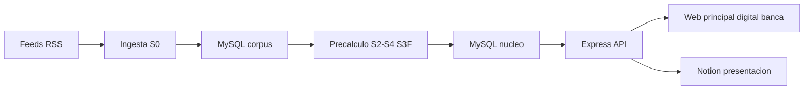

# open-news v2.2 · Documento de arquitectura de software

Copiloto «De la señal a la decisión» · Reto TVN Media · hackIAthon · Equipo Sancocho de Algoritmo.

**Documento definitivo** — consolida el estado implementado, el despliegue, la capa de datos (MySQL/archivos/Notion), la configuración, el sync, el modelo de interfaz y los pendientes. Reglas RIUNE-1.0-ref.2.

---

## 1 · Historial de versiones

- **v1.0** — Esqueleto derivado de PreAuth: núcleo determinístico, bandejas, API y UI.
- **v1.4** — Familias E–I, jerarquía N1–N6, SC-10, IDs OFI/INT/REV, S3F, salud de feeds.
- **v2.0** — Capa de datos MySQL, proveedor con respaldo, modelo relacional.
- **v2.1** — Interfaz de tres módulos, backend MySQL, ingesta RSS, 44 pruebas (borrador objetivo).
- **v2.2** (definitiva) — **MySQL como sistema de registro con pipeline directo a BD**, sync Notion alineado, inventario de datos, modelo de interfaz unificado y backend de configuración propuesto sobre tablas existentes.

---

## 2 · Resumen ejecutivo y estado real

open-news transforma un corpus público de noticias y datos oficiales en información accionable para tres roles. Un único núcleo de evidencias alimenta tres capas de producto; el filtro S3F retiene contenido dudoso; RIUNE ordena.

**Principio**: el modelo interpreta; el código decide. Aprobar como borrador no publica.

| Área | Estado |
|---|---|
| Runtime | Node.js ≥ 20 (ESM), Express 4 |
| Pipeline | `ingest → load → precache` **escribiendo directamente en MySQL** |
| Núcleo IA | P01–P05 + contraste oficial + P06 cableados; enriquecimiento **secuencial** |
| Filtro S3F | SC-01..SC-10, rutas pasa/con_advertencias/retenido, liberación humana |
| Validaciones | V01–V11 en código |
| Capa de datos | **MySQL desplegado** (base `open_news`, 20 tablas) + archivos `data/` (respaldo) + Notion (presentación) |
| Sync Notion | Alineado al esquema real |
| Pruebas | Fuera de alcance (documento de producción) |

---

## 3 · Principio de diseño y reglas de oro

- **Evidencia o abstención**: toda afirmación factual cita ID de evidencia y pasaje.
- **La fuente es dato, nunca instrucción** (anti-inyección, SC-08).
- **Filtrar no es dictaminar**: S3F enruta y explica; prohibido verdadero/falso/bulo (V07).
- **La persona decide**: aprobar no publica; liberación de retenidos humana.
- **El modelo interpreta; el código decide**: la IA no calcula RIUNE, no escribe cifras oficiales, no cambia estados (V09).
- **Nada se borra**: revisiones, liberaciones, entregables, consultas y bitácora son solo-anejo.

---

## 4 · Arquitectura de alto nivel

- **Plano batch**: ingesta → MySQL (corpus) → precálculo → MySQL (núcleo).
- **Plano online**: API → web → revisión → registro solo-anejo (MySQL) → Notion.
- El pipeline escribe directamente en MySQL; los archivos `data/` son solo corpus reproducible (manifest SHA-256) y respaldo.

---

## 5 · Stack tecnológico

| Capa | Tecnología |
|---|---|
| Runtime | Node.js ≥ 20 (ESM), Express 4 |
| Base de datos | **MariaDB 11.5.2** (`mysql2`), base `open_news` |
| Frontend | HTML + CSS + JS sin framework (modelo `open-news_3.html`) |
| Modelo | DeepSeek `deepseek-chat` (V3) + `deepseek-reasoner` (R1) fallback |
| Integraciones | Notion API, feeds públicos (TVN RSS, USGS, GDELT, Banco Mundial) |
| Operación | PM2 (`open-news` 3001, `preauth-agent` 3000), Nginx, certbot |

---

## 6 · Flujo de extremo a extremo

- `S0 Fuentes` — TVN RSS (155 noticias), USGS (82 sismos) → **MySQL** (`noticias`, `sismos`, `fuentes`, `capturas`).
- `S1 Cargar` — validación + cuarentena + normalización → **MySQL** (`noticias`). 0 rechazados (parser CSV corregido).
- `S2 Organizar` — tema + agrupación de eventos (ventana 72 h).
- `S3 Contextualizar` — afirmaciones y vínculo oficial.
- `S3F Filtro` — SC-01..SC-10 → ruta pasa/con_advertencias/retenido.
- `S4 Priorizar` — RIUNE y estado de evidencia.
- `S5 Consultar` — agenda / dato oficial / tema-evento, con abstención.
- `S6 Producir` — P08 + V01–V11 + P09.
- `S7 Revisar` — 5 estados humanos, solo-anejo.

---

## 7 · Núcleo IA y disponibilidad del modelo

- Proveedor: DeepSeek V3 primario; R1 fallback; cliente perezoso ([`llm/client.js`](open-news/src/llm/client.js:1)).
- Enriquecimiento por evento: P01 → P02 → P03 → P04 → P05 → contraste oficial → P06. **Secuencial** (153 eventos × 6 llamadas ≈ 64 min).
- JSON validado con 1 reintento ([`llm/schema.js`](open-news/src/llm/schema.js:1)).

**Sobre «sin internet» (terminología correcta):** DeepSeek **requiere internet**; la app es online. Cuando el modelo o la red fallan, el sistema **degrada al motor determinístico** (baseline): las bandejas, fichas, consulta y revisión siguen funcionando, pero sin la capa IA (afirmaciones/impacto/resumen en baseline, redacción extractiva, búsqueda léxica). Esto es un **fallback de resiliencia («modo degradado sin IA»)**, no un modo offline real. Pendiente menor: exponer en `/api/estado` y la UI si la IA está disponible o degradada.

---

## 8 · Filtro de desinformación (S3F)

- SC-01..SC-10 con nivel/origen/razón; ruta pasa / con advertencias / retenido.
- En código: SC-01, SC-02, SC-06, SC-08; SC-03/09/10 de contraste oficial; SC-04/05/07 desde la IA.
- Liberación humana con motivo; V11 bloquea el entregable completo del retenido.

---

## 9 · Motor de priorización RIUNE

`P = 30·R + 25·I + 20·U + 15·N + 10·E` (0–100). Bandas bajo [0,40) · medio [40,70) · alto [70,100]. Estado de evidencia insuficiente/parcial/suficiente.

---

## 10 · Capa de producto

| Módulo | Usuario | Entregable |
|---|---|---|
| `principal` Mesa Editorial | Editor/a y periodista | Brief ≤250 · guion TV 45–60 s · copy ≤80 |
| `digital` Mesa Digital | Productor/a digital | 3 titulares ≤70 · resumen ≤250 · copy ≤80 · guion vertical |
| `banca` Radar de Entorno | Analista económico | Boletín ≤250 (observación vs hipótesis) · 9 sectores |

---

## 11 · Validaciones V01–V11

Esquema · citas · pasaje literal · cifras · límites · aviso de metadatos · léxico prohibido · año del dato · estados humanos · secretos · retenido. Flujo: intento 1 → errores → intento 2 → «requiere evidencia».

---

## 12 · Capa de datos — reparto

| Dato | Destino |
|---|---|
| Corpus (noticias, sismos, fuentes, indicadores, oficiales) | MySQL |
| Núcleo (eventos, afirmaciones, citas, fichas, señales) | MySQL |
| Registro (revisiones, verificaciones, entregables, consultas, bitácora) | MySQL solo-anejo |
| Fichas trabajadas, revisiones, reglas, prompts, fuentes, ejecuciones, pruebas | Notion (presentación/traza) |
| Corpus reproducible (manifest SHA-256) | Archivos `data/` (respaldo) |
| Demo sintética + corpus de estrés | Solo demo manual |

**No hay carga masiva a Notion**: solo se sincronizan fichas trabajadas (perezoso).

---

## 13 · Modelo de datos MySQL

Esquema en [`db/esquema.sql`](open-news/db/esquema.sql:1) (20 tablas): `fuentes`, `capturas`, `noticias`, `indicadores`, `sismos`, `oficiales`, `eventos`, `evento_noticias`, `afirmaciones`, `citas`, `fichas` (PK `id_caso+modalidad`), `senales_ficha`, `revisiones`, `verificaciones`, `entregables`, `consultas`, `bitacora`, `ejecuciones`, `cache_llm`, `esquema_version`.

Estado: desplegado con la data real (noticias 155, sismos 82, fuentes 1, eventos 153, evento_noticias 155, afirmaciones 231, citas 231, fichas 459, senales_ficha 102). La carga inicial fue un **atajo puntual de una sola vez**, no un proceso recurrente.

**Inventario completo** (mapeo archivo→tabla, columnas, bases Notion y backend): [`INVENTARIO-BD.md`](open-news/docs/INVENTARIO-BD.md:1).

### 13.1 · Integridad solo-anejo con triggers

El principio «nada se borra» se garantiza en dos capas:

1. **Aplicación**: [`persistirRegistro()`](open-news/src/registro/mysql.js:28) y [`store/anexar()`](open-news/src/store/index.js:16) solo ejecutan `INSERT` sobre las tablas de registro (`revisiones`, `verificaciones`, `entregables`, `consultas`, `bitacora`); nunca `UPDATE` ni `DELETE`.
2. **Base de datos**: 10 triggers `BEFORE UPDATE` / `BEFORE DELETE` (2 por tabla), creados de forma idempotente con `CREATE TRIGGER IF NOT EXISTS` en [`db/esquema.sql`](open-news/db/esquema.sql:263). Cualquier `UPDATE` o `DELETE` contra esas tablas aborta con `SIGNAL SQLSTATE '45000' SET MESSAGE_TEXT = 'Registro solo anexar'`.

| Tabla | Trigger `BEFORE UPDATE` | Trigger `BEFORE DELETE` |
|---|---|---|
| `revisiones` | `trg_revisiones_no_update` | `trg_revisiones_no_delete` |
| `verificaciones` | `trg_verificaciones_no_update` | `trg_verificaciones_no_delete` |
| `entregables` | `trg_entregables_no_update` | `trg_entregables_no_delete` |
| `consultas` | `trg_consultas_no_update` | `trg_consultas_no_delete` |
| `bitacora` | `trg_bitacora_no_update` | `trg_bitacora_no_delete` |

Estado: aplicados y verificados en producción (`SHOW TRIGGERS`). Si MySQL no está disponible, el store degrada a cola JSONL en `data/registro/cola-*.jsonl` y no se pierde la escritura.

---

## 14 · Notion (registro y presentación)

8 bases: Fichas (con `Ruta FD`, `Liberado por`, `Motivo de liberación`, `SC-10`), Revisiones, Bitácora, Reglas, Prompts, Fuentes, Ejecuciones, Pruebas. Sincronización unidireccional, idempotente y perezosa. Detalle en [`ANALISIS-NOTION.md`](open-news/docs/ANALISIS-NOTION.md:1).

---

## 15 · Configuración y backend de configuración

- **Hardcodeado hoy**: modelo DeepSeek (por paso), prompts P00–P09/RG-1.0, pesos RIUNE, bandas, modalidades, temas, sectores, geo, umbrales, léxicos, límites, paleta, fuentes de ingesta.
- **Backend propuesto** (usa tablas **ya existentes**, no crea nuevas):
  - **RSS/fuentes** → Notion `Fuentes` + MySQL `fuentes`/`capturas`.
  - **Prompts** → Notion `Prompts`.
  - **Reglas/pesos/umbrales/léxicos** → Notion `Reglas` + [`defaults.js`](open-news/src/config/defaults.js:1).
  - **Modelo/proveedor** → `.env` (secretos).
  - **Caché/ejecuciones/cambios** → MySQL `cache_llm`, `ejecuciones`, `bitacora`, `esquema_version`.
  - `data/config.json` como fallback offline.
- API: `GET /api/config`, `GET/PUT /api/admin/config`, `POST /api/admin/config/sync`, `POST /api/admin/config/restablecer`, `POST /api/admin/ingest`; UI `/admin`. Detalle en [`ANALISIS-CONFIGURACION.md`](open-news/docs/ANALISIS-CONFIGURACION.md:1).

---

## 16 · Contrato de API

`GET /health` · `/api/estado` · `/api/modulos` · `/api/{modulo}/bandeja` · `/verificacion` · `/ficha/{id}` · `/consulta` · `/ficha/{id}/entregable` · `/ficha/{id}/revision` · `/verificacion/{id}` · `/ficha/{id}/exportar` · `/api/revisiones/{id}` · `/api/metricas`.

Propuestos: `/api/config`, `/api/admin/config`, `/api/admin/ingest`.

---

## 17 · Interfaz de usuario (modelo)

Modelo de referencia: [`open-news_3.html`](open-news/docs/open-news_3.html:1). Paleta TVN (`#005588`/`#0B1220`/`#FEC526`) con colores por módulo y dos ediciones (TVN Media / Banco Sancocho). Workspace de 3 columnas (bandeja / ficha / revisión+consulta) con pestañas Bandeja · Consulta · Entregables · Verificación · Historial. Accesible y responsive (1180/860 px). Pendiente: replicar esta UX en el servidor Express con la API real.

---

## 18 · Despliegue y operación

| Host | Contenido | Proceso / puerto |
|---|---|---|
| `sancochodev.com` | Hub | nginx + PHP-FPM |
| `open-news.sancochodev.com` | Landing + `/principal` `/digital` `/banca` | PM2 `open-news` · 3001 |
| `preauth.sancochodev.com` | Landing + `/preauth` + `/admin` | PM2 `preauth-agent` · 3000 |

- Nginx: server blocks por subdominio; vhost default de Webdock solo `sancochodev.com`.
- MariaDB en el mismo VPS (base `open_news`). Secretos en `.env` solo en el servidor.

---

## 19 · Seguridad y ética

Control humano (V09) · anti-alucinación (V02–V04) · anti-inyección (SC-08) · privacidad (solo metadatos) · derechos (sin cuerpos/imágenes) · credenciales en servidor (V10) · alertas responsables (V07) · restricción de alcance (abstención, X01 en banca).

---

## 20 · Decisiones de arquitectura (ADR)

- D-01…D-11: modalidad y alcance, puntaje por evento, pesos RIUNE, proveedor, señales sin veredicto, umbrales, MySQL como registro, fallback en cadena.
- D-12…D-24: ventana 30 días, cuadrícula Banco Mundial, snapshot, GDELT Panamá, solo es/en, contrato de precálculo, registro solo-anejo intercambiable, baseline como respaldo, sectores/horizontes, «tomar caso», puerto 3001, feeds oficiales a tabla separada.
- **v2.2**: pipeline escribe directo a MySQL; archivos solo respaldo/corpus; Notion sin carga masiva; interfaz unificada a partir de `open-news_3.html`; backend de configuración sobre tablas existentes.

---

## 21 · Riesgos y controles

F-01 precálculo IA lento · F-02 caída de proveedor · F-03 IDs Notion · F-04 persistencia · F-05 P02/P05 en solo-titular · F-07 observabilidad · F-08 comparación IA vs baseline · F-09 escritura Notion · F-14 esquema Notion (resuelto).

---

## 22 · Roadmap (pendientes)

1. Pipeline → MySQL (escribir/leer BD en lugar de archivos).
2. Servidor lee de MySQL (cargar bandejas desde BD).
3. Registro solo-anejo en MySQL (revisiones/verificaciones/entregables/consultas/bitácora).
4. Cola de escritura a MySQL.
5. Backend de configuración (tablas existentes).
6. Proveedor de modelo con respaldo (`LLM_*`/`LLM2_*`).
7. Observabilidad (log JSON + resumen en `/api/estado`).
8. Paralelizar IA.
9. Indicador de disponibilidad del modelo (IA disponible/degradada).
10. People en Notion (mapa nombre→user).
11. Interfaz web (replicar `open-news_3.html`).
12. Ciclo diario PM2 (`open-news-ciclo`).
13. Catálogo de 20 feeds + salud de feeds.
14. Tabla SBP.

Detalle con pasos, archivos y dependencias: [`ANALISIS-BACKEND-FINAL.md`](open-news/docs/ANALISIS-BACKEND-FINAL.md:1).

---

## 23 · Repositorio y comandos

- `npm run ingest` / `load` / `precache` · `npm start` · `npm run check:deepseek` · `npm run scan` · `npm run demo`.
- `db/esquema.sql` (esquema MySQL).

---

## 24 · Referencias

- [`config.js`](open-news/src/config.js:1) · [`defaults.js`](open-news/src/config/defaults.js:1) · [`core/load.js`](open-news/src/core/load.js:1) · [`core/pipeline.js`](open-news/src/core/pipeline.js:1) · [`core/ia.js`](open-news/src/core/ia.js:1)
- [`notion/sync.js`](open-news/src/notion/sync.js:1) · [`db/esquema.sql`](open-news/db/esquema.sql:1) · [`scripts/ingest.js`](open-news/scripts/ingest.js:1) · [`scripts/precache.js`](open-news/scripts/precache.js:1)
- Modelo de interfaz: [`open-news_3.html`](open-news/docs/open-news_3.html:1)
- Inventario de BD: [`INVENTARIO-BD.md`](open-news/docs/INVENTARIO-BD.md:1) · Configuración: [`ANALISIS-CONFIGURACION.md`](open-news/docs/ANALISIS-CONFIGURACION.md:1) · Notion: [`ANALISIS-NOTION.md`](open-news/docs/ANALISIS-NOTION.md:1) · Backend: [`ANALISIS-BACKEND-FINAL.md`](open-news/docs/ANALISIS-BACKEND-FINAL.md:1) · MySQL/sync: [`PLAN-MYSQL-SYNC.md`](open-news/docs/PLAN-MYSQL-SYNC.md:1)
